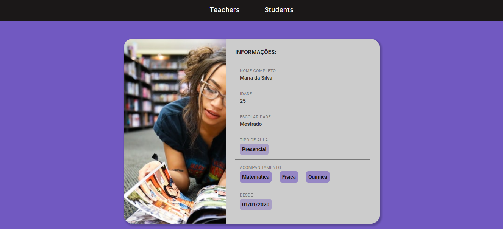
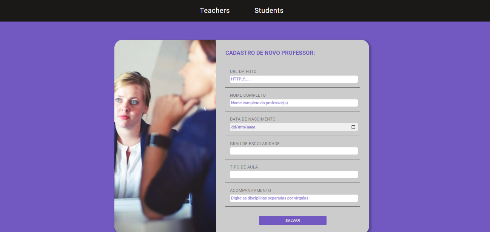

<h1 align="center">Private Classes<h1>

---
## Índice
- [Sobre](#-sobre)
- [Etapas](#-etapas)

---
### Sobre
Desafio proposto no LaunchBase da [Rocketseat](https://rocketseat.com.br/). A ideia consiste no desenvolvimento de uma aplicação de cadastro de alunos e professores para aulas particulares.

---

### Etapas
A primeira etapa consistiu em criar as rotas e desenvolver o header. 

A segunda etapa consistiu na criação de um card contendo informações sobre os professores, como foto, nome, idade, grau de escolaridade, tipo de aula, materias ensinadas e data de entrada na plataforma.

Em seguida foi criada a página contendo um formulário para cadastramento dos professores na plataforma. bem como as rotas.

---

### Produção
Projeto desenvolvido por Camila Almeida Diniz.
 
Durante a realização do LaunchBase da [Rockeseat](https://rocketseat.com.br/)

### Imagens
As imagens e ícones foram obtidas dos seguintes sites:
- [Unsplash](https://unsplash.com/)